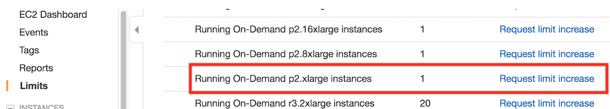

# Run on AWS

For JSALT 2018 Summer School, we provide pre-built environment as AMI for immediate use. To use,
please find and use ami-e54d0f9d to launch GPU instances.

In this tutorial, we will go through how to allocate a CPU/GPU
instance in AWS and build it from scratch step-by-step.

## Select and run an instance

We first need [an AWS account](https://aws.amazon.com/), and then go the EC2 console
after login in.


[Optional] You can select a region on the right upper corner that is close to
your location to reduce the network latency. But also note that some regions may
not have GPUs instances.

Then click "launch instance" to select the operation system and instance type.


We selected "Ubuntu 16.06":


and "p2.xlarge", which contains a single Nvidia K80 GPU. Note that there is a
large number of instance, refer to
[ec2instances.info](http://www.ec2instances.info/) for detailed configurations
and fees.


Note that we need to check the instance limits to guarantee that we can request
the resource. If running out of limits, we can request more capacity by clicking
the right link, which often takes about a single workday to process.




On the next step we increased the disk from 8 GB to 40 GB so we have enough
space to install CUDA and store a reasonable size dataset. For large-scale
datasets, we can "add new volume". Also you selected a very powerful GPU
instance such as "p3.8xlarge", make sure you selected "Provisioned IOPS" in the
volume type for better I/O performance.


Then we launched with other options as the default values. The last step before
launching is choosing the ssh key, you may need to generate and store a key if
you don't have one before.


After clicked "launch instances", we can check the status by clicking the
instance ID link.


Once the status is green, we can right-click and select "connect" to get the access instruction.


For example, here we ssh to the instance with the provided address:


## Install packages

Let's first update and install basic packages after we sshed to the instance.


```bash
sudo apt-get update && sudo apt-get install -y build-essential python-pip
```

### Install CUDA

If you launched a CPU-only instance, you can skip this step.

Let go to [Nvidia website](https://developer.nvidia.com/cuda-downloads) to download a recent CUDA and install it by following
its instructions.


For example, we can download CUDA 9.1 and install it:

```bash
wget https://developer.nvidia.com/compute/cuda/9.1/Prod/local_installers/cuda_9.1.85_387.26_linux
sudo sh cuda_9.1.85_387.26_linux
```


We need to answer a few questions during the installation.

```
accept/decline/quit: accept
Install NVIDIA Accelerated Graphics Driver for Linux-x86_64 387.26?
(y)es/(n)o/(q)uit: y
Do you want to install the OpenGL libraries?
(y)es/(n)o/(q)uit [ default is yes ]: y
Do you want to run nvidia-xconfig?
(y)es/(n)o/(q)uit [ default is no ]: n
Install the CUDA 9.1 Toolkit?
(y)es/(n)o/(q)uit: y
Enter Toolkit Location
 [ default is /usr/local/cuda-9.0 ]:
Do you want to install a symbolic link at /usr/local/cuda?
(y)es/(n)o/(q)uit: y
Install the CUDA 8.0 Samples?
(y)es/(n)o/(q)uit: n
```

After installation, we can check the GPU status by


```bash
nvidia-smi
```

Finally, add the CUDA library path into system:

```bash
echo "export LD_LIBRARY_PATH=\${LD_LIBRARY_PATH}:/usr/local/cuda/lib64" >>.bashrc
```

### Install MXNet

Since we install CUDA 9.1, we can just install `mxnet-cu91`. Here we used the
`--pre` flag to install the latest release.

```bash
pip install --pre mxnet-cu91
```

Once it's done, run `python` in terminal, and try to import mxnet for a sanity check.

```python
import mxnet
```
